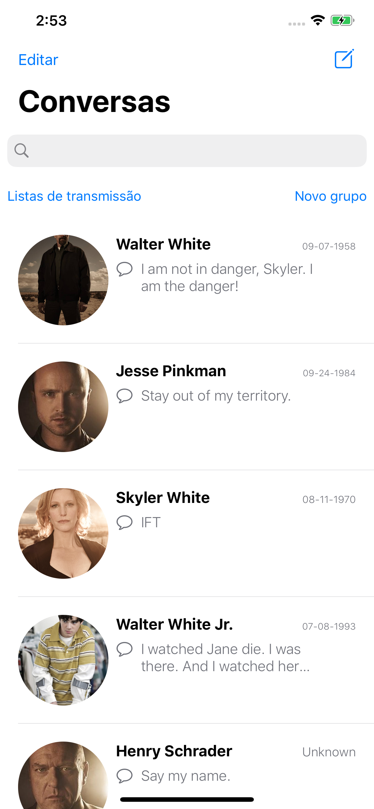
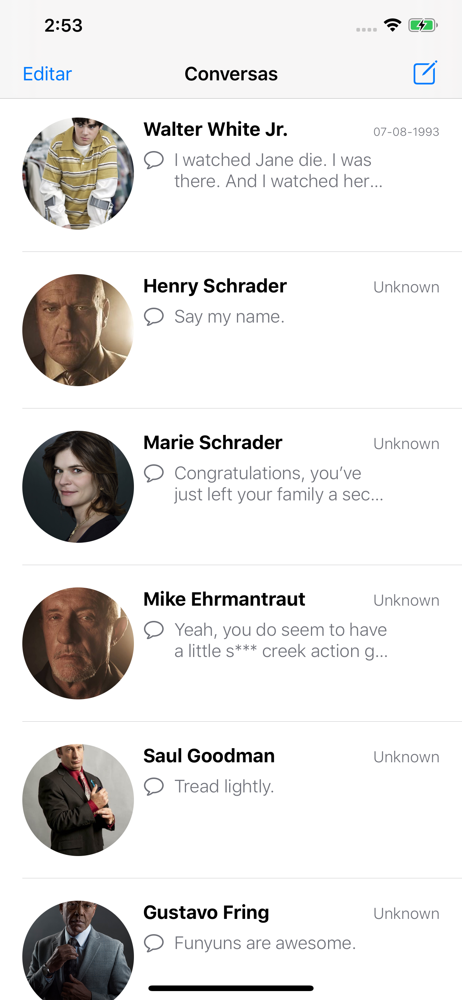

# breakingApp

Mais um pequeno projeto para praticar: dessa vez optei por "clonar" a mainview do WhatsApp usando os dados da API da série Breaking Bad!

Começando pela classe encarregada de definir as funçõoes para requisições a API: usei o pod Alamofire que facilita as requisiçõe
s e com a closure posso tratar a resposta com uma classe do tipo struct codable. Criei uma classe DAO para centralizar as listas 
(de personagens e quotes) para ficar mais organizado a manipulação dos dados.

* Usei enum (novidade pra mim) para separar os links de personagens e quotes para requisição a API.

Usei o pod Imaginary que ajudou MUITO a alterar as imagens da UIImageView, convertendo a URL que é retornado da API em imagem. 

Fiz uma UITableViewCell reutilizavel (XIB) e totalmente personalizada usando cornerRadius na imagem, constraints de margem e 
espaçamento entre os labels; com stackview também.

Conceitos de padrão de projeto usando singleton (no Services e CharactersDAO) para ser usado apenas uma instância 
da classe no projeto.

do catch, extension (muuuito mais organizado), delegates, datasource, UISearchBarDelegate com filtro das conversas.

Ps.: as mensagens são aleatórias da série; alguns personagens estão com quotes que não são deles
Ps2.: a searchbar FUNCIONA!

[Referêrencia da API](https://breakingbadapi.com)

A pouco tempo atrás não fazia ideia de tudo isso auahuahua. Seguimos!!
